# HOTOSM Auth

> Centralized authentication for HOTOSM applications using Hanko SSO + OSM OAuth

---

## Architecture

```mermaid
%%{init: {'theme': 'base', 'themeVariables': { 'fontSize': '16px' }}}%%
flowchart TB
    subgraph Top[" "]
        direction LR
        Browser[🌐 **Browser**]

        subgraph LoginService["login.hotosm.org"]
            direction LR
            Hanko[**Hanko SSO**]
            LoginAPI[**Login API**]
        end
    end

    subgraph Backends["Application Backends"]
        direction LR
        Portal[**Portal**<br/>FastAPI]
        DroneTM[**Drone-TM**<br/>FastAPI]
        fAIr[**fAIr**<br/>Django]
        OAM[**OAM**<br/>FastAPI]
    end

    Browser -->|"1️⃣ Authenticate"| LoginService
    LoginService -->|"2️⃣ Set-Cookie: JWT<br/>(domain=.hotosm.org)"| Browser
    Browser -->|"3️⃣ JWT Cookie"| Portal
    Browser -->|"3️⃣ JWT Cookie"| DroneTM
    Browser -->|"3️⃣ JWT Cookie"| fAIr
    Browser -->|"3️⃣ JWT Cookie"| OAM

    style Top fill:none,stroke:none
```



---

## Documentation

### Core Concepts

| Document | Description |
|----------|-------------|
| [**Overview**](overview.md) | Auth flow, JWT validation, user mapping |
| [**Web Component**](web-component.md) | `<hotosm-auth>` Lit element |

### Project Implementations

| Project | Stack | Documentation |
|---------|-------|---------------|
| Portal | FastAPI + React | [Implementation](projects/portal.md) |
| Drone-TM | FastAPI + React | [Implementation](projects/drone-tm.md) |
| fAIr | Django + React | [Implementation](projects/fair.md) |
| OpenAerialMap | FastAPI + React | [Implementation](projects/oam.md) |

---

## Packages

### Python

```bash
# Core only
pip install "hotosm-auth @ git+https://github.com/hotosm/login.git@auth-libs-v0.2.2#subdirectory=auth-libs/python"

# With FastAPI
pip install "hotosm-auth[fastapi] @ git+https://github.com/hotosm/login.git@auth-libs-v0.2.2#subdirectory=auth-libs/python"

# With Django
pip install "hotosm-auth[django] @ git+https://github.com/hotosm/login.git@auth-libs-v0.2.2#subdirectory=auth-libs/python"
```

### Web Component

Distributed as pre-built JS bundles. Copy from `auth-libs/web-component/dist/`:

```
hanko-auth.esm.js    # ES Module
hanko-auth.iife.js   # Browser global
hanko-auth.umd.js    # Universal
```

---

## Quick Start

### FastAPI (5 min)

```python
# main.py
from fastapi import FastAPI
from hotosm_auth import AuthConfig
from hotosm_auth_fastapi import init_auth, CurrentUser, osm_router

app = FastAPI()

# Initialize auth from .env
auth_config = AuthConfig.from_env()
init_auth(auth_config)

# Mount OSM OAuth routes
app.include_router(osm_router, prefix="/api/auth/osm")

# Protected endpoint
@app.get("/me")
async def me(user: CurrentUser):
    return {"id": user.id, "email": user.email}
```

### Django (5 min)

```python
# settings.py
INSTALLED_APPS = [
    ...
    'hotosm_auth_django',
]

MIDDLEWARE = [
    ...
    'hotosm_auth_django.HankoAuthMiddleware',
]

# views.py
from hotosm_auth_django import login_required

@login_required
def my_view(request):
    user = request.hotosm.user
    return JsonResponse({"email": user.email})
```

### Frontend

```html
<hotosm-auth
  hanko-url="https://login.hotosm.org"
  osm-required
  redirect-after-login="/"
></hotosm-auth>
```

---

## Environment Variables

```bash
# Required
HANKO_API_URL=https://login.hotosm.org
COOKIE_SECRET=your-32-char-secret

# OSM OAuth (for OSM linking)
OSM_CLIENT_ID=your-osm-client-id
OSM_CLIENT_SECRET=your-osm-client-secret
OSM_REDIRECT_URI=http://localhost:8000/api/auth/osm/callback

# Optional
JWT_AUDIENCE=your-app-audience
COOKIE_DOMAIN=.hotosm.org
COOKIE_SECURE=true
```

---

## Source Repository

```
github.com/hotosm/login
├── backend/
├── frontend/
├── auth-libs/                      # ← Auth libraries
│   ├── python/
│   │   ├── src/
│   │   │   ├── hotosm_auth/           # Core (JWT, config, crypto)
│   │   │   ├── hotosm_auth_fastapi/   # FastAPI integration
│   │   │   └── hotosm_auth_django/    # Django integration
│   │   └── pyproject.toml
│   ├── web-component/
│   │   ├── src/hanko-auth.ts          # Lit component source
│   │   └── dist/                       # Built bundles
│   └── scripts/
│       ├── build.sh                    # Build all
│       └── distribute.sh               # Copy dist to projects
└── ...
```
