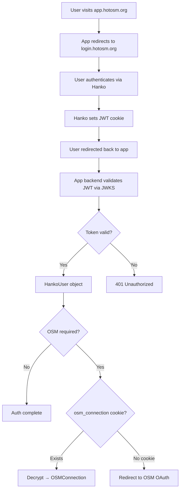

# Architecture Overview

## What is auth-libs?

**auth-libs** provides centralized authentication for all HOTOSM applications:

- **Hanko SSO**: Passwordless authentication via passkeys/email
- **OSM OAuth**: OpenStreetMap account linking
- **User Mapping**: Maps Hanko users to app-specific user IDs

| Component | Purpose |
|-----------|---------|
| `hotosm_auth` | Core Python package (JWT, config, crypto) |
| `hotosm_auth_fastapi` | FastAPI integration (dependencies, routes) |
| `hotosm_auth_django` | Django integration (middleware, decorators) |
| `<hotosm-auth>` | Web component (Lit-based auth UI) |

---

## Package Structure

```
auth-libs/
│
├── python/src/                       # Python packages
│   │
│   ├── hotosm_auth/                  # Core package (no framework deps)
│   │   ├── config.py                 # AuthConfig (Pydantic)
│   │   ├── models.py                 # HankoUser, OSMConnection
│   │   ├── jwt_validator.py          # JWT validation via JWKS
│   │   ├── crypto.py                 # Cookie encryption (Fernet)
│   │   └── osm_oauth.py              # OSM OAuth client
│   │
│   ├── hotosm_auth_fastapi/          # FastAPI integration
│   │   ├── dependencies.py           # CurrentUser, OSMConnectionRequired
│   │   ├── osm_routes.py             # /auth/osm/* endpoints
│   │   └── admin_routes.py           # User mapping admin API
│   │
│   └── hotosm_auth_django/           # Django integration
│       ├── middleware.py             # HankoAuthMiddleware
│       ├── admin_routes.py           # Admin URL patterns
│       └── models.py                 # HankoUserMapping model
│
└── web-component/                    # Frontend web component
    ├── src/hanko-auth.ts             # Lit web component
    └── dist/                         # Built bundles (esm, iife)
```

---

## Authentication Flow



---

## User Mapping

Apps with existing users need to map Hanko UUIDs to app user IDs.

### Problem

```
Hanko: id="550e8400-..."    ←→    App: id=42
       email=user@x.com            email=user@x.com
```

### Solution

```sql
CREATE TABLE hanko_user_mappings (
    hanko_user_id VARCHAR(255) PRIMARY KEY,
    app_user_id VARCHAR(255) NOT NULL,
    app_name VARCHAR(255) DEFAULT 'default',
    created_at TIMESTAMP,
    updated_at TIMESTAMP
);
```

### Strategies

1. **Auto-link by email** - Find existing user with same email
2. **Create new user** - Create app user from Hanko data
3. **Admin assigns** - Manual mapping via admin API
4. **Onboarding flow** - User completes registration after login

---

## Environment Variables

### Backend

```bash
# Required
HANKO_API_URL=https://login.hotosm.org
COOKIE_SECRET=generate-with-python-secrets-32-bytes

# OSM OAuth (enables OSM linking)
OSM_CLIENT_ID=your-osm-app-id
OSM_CLIENT_SECRET=your-osm-app-secret

# Optional
COOKIE_DOMAIN=.hotosm.org        # auto-detected from HANKO_API_URL
ADMIN_EMAILS=admin@hotosm.org    # comma-separated, for admin routes

# Dual-auth apps (legacy + hanko)
AUTH_PROVIDER=hanko              # "legacy" or "hanko"
```

### Frontend

```bash
# Authentication mode (for dual-auth apps)
VITE_AUTH_PROVIDER=hanko         # "legacy" or "hanko"

# Login service URL (handles Hanko auth and OSM OAuth)
VITE_HANKO_URL=https://login.hotosm.org
```

> **Note:** `VITE_HANKO_URL` is the only authentication URL variable needed.

### Variables by Project

| Variable | Portal | Drone-TM | fAIr | OAM | Login |
|----------|--------|----------|------|-----|-------|
| **Backend** |
| `HANKO_API_URL` | ✅ | ✅ | ✅ | ✅ | ✅ |
| `COOKIE_SECRET` | ✅ | ✅ | ✅ | ✅ | ✅ |
| `OSM_CLIENT_ID` | ✅ | - | ✅ | - | ✅ |
| `OSM_CLIENT_SECRET` | ✅ | - | ✅ | - | ✅ |
| `ADMIN_EMAILS` | ✅ | ✅ | ✅ | - | - |
| `AUTH_PROVIDER` | - | ✅ | ✅ | - | - |
| **Frontend** |
| `VITE_HANKO_URL` | ✅ | ✅ | ✅ | ✅ | ✅ |
| `VITE_AUTH_PROVIDER` | - | ✅ | ✅ | - | - |

---

## Installation

### Python (via git)

```bash
# Core only
pip install "hotosm-auth @ git+https://github.com/hotosm/login.git@auth-libs-v0.2.2#subdirectory=auth-libs/python"

# With FastAPI
pip install "hotosm-auth[fastapi] @ git+https://github.com/hotosm/login.git@auth-libs-v0.2.2#subdirectory=auth-libs/python"

# With Django
pip install "hotosm-auth[django] @ git+https://github.com/hotosm/login.git@auth-libs-v0.2.2#subdirectory=auth-libs/python"
```

### pyproject.toml

```toml
dependencies = [
    "hotosm-auth[fastapi] @ git+https://github.com/hotosm/login.git@auth-libs-v0.2.2#subdirectory=auth-libs/python",
]
```

### Web Component

```html
<script src="/auth-libs/web-component/dist/hanko-auth.iife.js"></script>

<hotosm-auth hanko-url="https://login.hotosm.org"></hotosm-auth>
```

Or as ES module:

```javascript
import '/auth-libs/web-component/dist/hanko-auth.esm.js';
```
