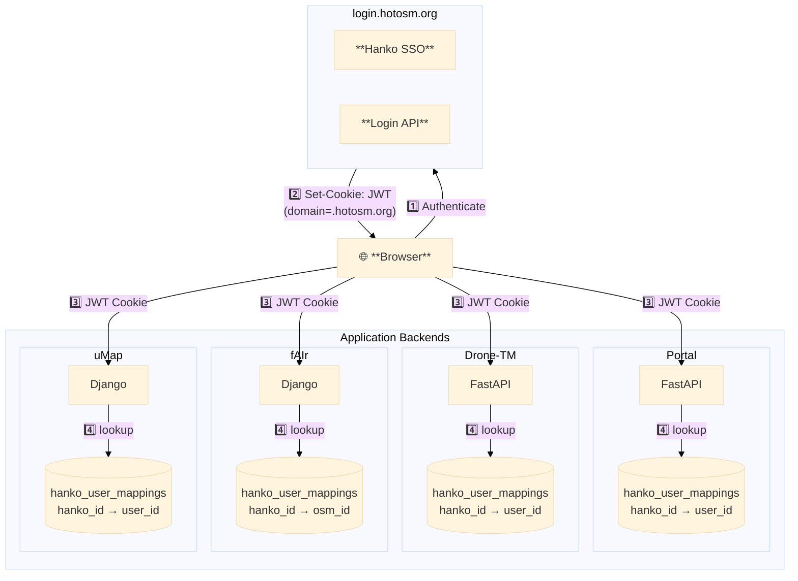

# HOTOSM Auth

> Centralized authentication for HOTOSM applications using Hanko SSO + OSM OAuth

---

## Architecture



---

## Documentation

### Core Concepts

| Document | Description |
|----------|-------------|
| [**Overview**](overview.md) | Auth flow, JWT validation, user mapping |
| [**Web Component**](web-component.md) | `<hotosm-auth>` Lit element |

---

## Packages

### Python

```bash
# Core only
pip install hotosm-auth==0.2.10

# With FastAPI
pip install "hotosm-auth[fastapi]==0.2.10"

# With Django
pip install "hotosm-auth[django]==0.2.10"
```

### Web Component

Published to npm as `@hotosm/hanko-auth`.

```bash
# React/Vite projects
pnpm add @hotosm/hanko-auth
```

```javascript
import '@hotosm/hanko-auth';
// <hotosm-auth> is now registered
```

For server-rendered apps (no bundler), load from CDN:

```html
<script type="module" src="https://cdn.jsdelivr.net/npm/@hotosm/hanko-auth@0.5.2/dist/hanko-auth.esm.js"></script>
```

---

## Quick Start

### FastAPI (5 min)

```python
# main.py
from contextlib import asynccontextmanager
from fastapi import FastAPI
from hotosm_auth import AuthConfig
from hotosm_auth_fastapi import init_auth, CurrentUser, osm_router

@asynccontextmanager
async def lifespan(app: FastAPI):
    auth_config = AuthConfig.from_env()
    init_auth(auth_config)
    yield

app = FastAPI(lifespan=lifespan)

# Mount OSM OAuth routes
# router already has prefix="/auth/osm" → routes: /api/auth/osm/login, /api/auth/osm/callback
app.include_router(osm_router, prefix="/api")

# Protected endpoint
@app.get("/me")
async def me(user: CurrentUser):
    return {"id": user.id, "email": user.email}
```

### Django (5 min)

```python
# settings.py
INSTALLED_APPS = [
    ...
    'hotosm_auth_django',
]

MIDDLEWARE = [
    ...
    'hotosm_auth_django.HankoAuthMiddleware',
]

# views.py
from hotosm_auth_django import login_required

@login_required
def my_view(request):
    user = request.hotosm.user
    return JsonResponse({"email": user.email})
```

### Frontend

```html
<hotosm-auth
  hanko-url="https://login.hotosm.org"
  osm-required
  redirect-after-login="/"
></hotosm-auth>
```

---

## Environment Variables

```bash
# Required
HANKO_API_URL=https://login.hotosm.org
COOKIE_SECRET=your-32-char-secret

# OSM OAuth (enables OSM linking when both are set)
OSM_CLIENT_ID=your-osm-client-id
OSM_CLIENT_SECRET=your-osm-client-secret
OSM_REDIRECT_URI=https://your-app/api/auth/osm/callback  # auto-generated if not set
OSM_SCOPES=read_prefs                 # default: read_prefs
OSM_API_URL=https://www.openstreetmap.org

# Cookie (auto-detected from HANKO_API_URL when not set)
COOKIE_DOMAIN=.hotosm.org
COOKIE_SECURE=true
COOKIE_SAMESITE=lax

# JWT
JWT_ISSUER=https://login.hotosm.org  # default: auto (uses HANKO_API_URL)
JWT_AUDIENCE=your-app-audience

# Admin
ADMIN_EMAILS=admin@hotosm.org        # comma-separated
```

---

## Source Repository

```
github.com/hotosm/login
├── backend/
├── frontend/
├── auth-libs/                          # ← Auth libraries
│   ├── python/
│   │   ├── src/
│   │   │   ├── hotosm_auth/            # Core (JWT, config, crypto)
│   │   │   │   ├── config.py
│   │   │   │   ├── crypto.py
│   │   │   │   ├── exceptions.py
│   │   │   │   ├── jwt_validator.py
│   │   │   │   ├── models.py
│   │   │   │   ├── osm_oauth.py
│   │   │   │   └── schemas/
│   │   │   ├── hotosm_auth_fastapi/    # FastAPI integration
│   │   │   │   ├── dependencies.py
│   │   │   │   ├── osm_routes.py
│   │   │   │   ├── db_models.py
│   │   │   │   ├── admin.py
│   │   │   │   ├── admin_routes.py
│   │   │   │   └── setup.py
│   │   │   ├── hotosm_auth_django/     # Django integration
│   │   │   │   ├── middleware.py
│   │   │   │   ├── osm_views.py
│   │   │   │   ├── models.py
│   │   │   │   ├── admin_routes.py
│   │   │   │   └── migrations/
│   │   │   └── hotosm_auth_litestar/   # Litestar integration
│   │   │       ├── dependencies.py
│   │   │       ├── osm_routes.py
│   │   │       ├── admin.py
│   │   │       ├── admin_routes.py
│   │   │       └── setup.py
│   │   └── pyproject.toml
│   ├── web-component/
│   │   ├── src/
│   │   │   ├── hanko-auth.ts           # Main Lit component
│   │   │   ├── hanko-auth.styles.ts
│   │   │   ├── hanko-translations.ts
│   │   │   ├── hanko-i18n-en.ts
│   │   │   ├── hanko-i18n-es.ts
│   │   │   ├── hanko-i18n-fr.ts
│   │   │   └── hanko-i18n-pt.ts
│   │   └── dist/                       # Published as @hotosm/hanko-auth on npm
│   └── scripts/
│       └── build.sh                    # Build all
└── ...
```

---

## Project Implementations

| Project | Stack | Documentation |
|---------|-------|---------------|
| Portal | FastAPI + React | [Implementation](projects/portal.md) |
| Drone-TM | FastAPI + React | [Implementation](projects/drone-tm.md) |
| fAIr | Django + React | [Implementation](projects/fair.md) |
| uMap | Django (server-rendered) | [Implementation](projects/umap.md) |
