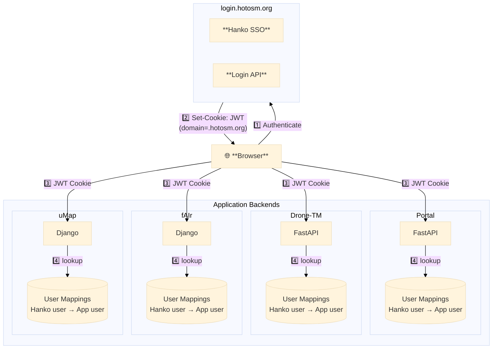

# HOTOSM Auth

> Centralized authentication for HOTOSM applications using Hanko SSO + OSM OAuth

---

## Architecture



---

## Quick Start

### FastAPI

```python
# main.py
from contextlib import asynccontextmanager
from fastapi import FastAPI
from hotosm_auth import AuthConfig
from hotosm_auth_fastapi import init_auth, CurrentUser, osm_router

@asynccontextmanager
async def lifespan(app: FastAPI):
    auth_config = AuthConfig.from_env()
    init_auth(auth_config)
    yield

app = FastAPI(lifespan=lifespan)

app.include_router(osm_router, prefix="/api")

@app.get("/me")
async def me(user: CurrentUser):
    return {"id": user.id, "email": user.email}
```

### Django

```python
# settings.py
INSTALLED_APPS = [..., 'hotosm_auth_django']

MIDDLEWARE = [..., 'hotosm_auth_django.HankoAuthMiddleware']

# views.py
from hotosm_auth_django import login_required

@login_required
def my_view(request):
    user = request.hotosm.user
    return JsonResponse({"email": user.email})
```

### Frontend

```html
<hotosm-auth
  hanko-url="https://login.hotosm.org"
  redirect-after-login="/"
></hotosm-auth>
```

---

## Reference

| Document | Description |
|----------|-------------|
| [**Overview**](overview.md) | Auth flow, JWT validation, user mapping, env vars |
| [**Python Libraries**](python-libs.md) | `hotosm_auth`, `hotosm_auth_fastapi`, `hotosm_auth_django` |
| [**Web Component**](web-component.md) | `<hotosm-auth>` Lit element — attributes, events, modes |

---

## Guides

| Document | Description |
|----------|-------------|
| [**Integration Guide**](integration-guide.md) | Step-by-step guide to integrate auth in a new app |
| [**Admin**](admin.md) | Manage user mappings via the login service dashboard |

---

## Implementations

| Project | Stack | Documentation |
|---------|-------|---------------|
| Portal | FastAPI + React | [Implementation](projects/portal.md) |
| Drone-TM | FastAPI + React | [Implementation](projects/drone-tm.md) |
| fAIr | Django + React | [Implementation](projects/fair.md) |
| uMap | Django (server-rendered) | [Implementation](projects/umap.md) |
