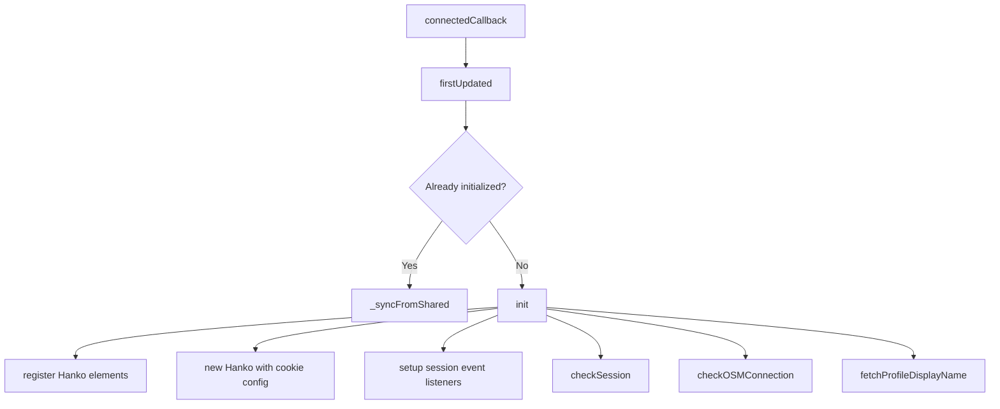
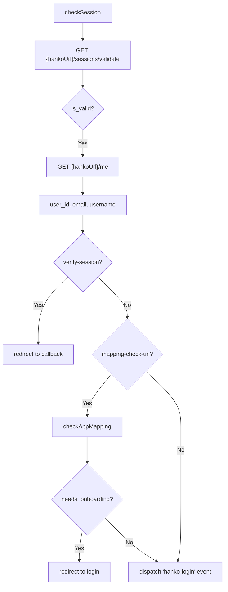
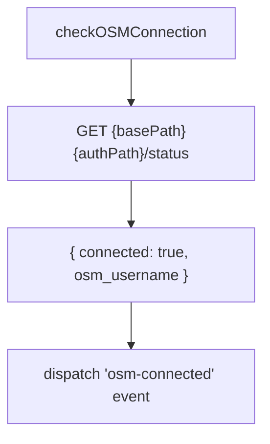

# Web Component: `<hotosm-auth>`

Lit-based web component for authentication UI.

## Source

```
auth-libs/web-component/
├── src/
│   └── hanko-auth.ts       # Main component (1500+ lines)
├── dist/                    # Built bundles
│   ├── hanko-auth.esm.js   # ES Module
│   ├── hanko-auth.iife.js  # Browser global
│   └── hanko-auth.umd.js   # Universal
└── package.json
```

---

## Installation

### Option 1: Script tag (IIFE)

```html
<script src="/auth-libs/web-component/dist/hanko-auth.iife.js"></script>

<hotosm-auth hanko-url="https://login.hotosm.org"></hotosm-auth>
```

### Option 2: ES Module

```javascript
import '/auth-libs/web-component/dist/hanko-auth.esm.js';

// Now <hotosm-auth> is registered
```

### Option 3: React wrapper

```tsx
import { useEffect, useRef } from 'react';
import '/auth-libs/web-component/dist/hanko-auth.esm.js';

export function AuthButton({ hankoUrl, onLogin }) {
  const ref = useRef<HTMLElement>(null);

  useEffect(() => {
    const el = ref.current;
    const handler = (e: CustomEvent) => onLogin(e.detail.user);
    el?.addEventListener('hanko-login', handler);
    return () => el?.removeEventListener('hanko-login', handler);
  }, [onLogin]);

  return (
    <hotosm-auth
      ref={ref}
      hanko-url={hankoUrl}
      osm-required
    />
  );
}
```

---

## Attributes

### Core

| Attribute | Type | Default | Description |
|-----------|------|---------|-------------|
| `hanko-url` | string | `window.location.origin` | Hanko API URL for SDK initialization and JWT validation |
| `login-url` | string | `${hanko-url}/app` | Login page URL (override for standalone mode) |
| `base-path` | string | `""` | Base URL for OSM OAuth endpoints. Usually same as `hanko-url` since login service hosts both Hanko and OSM auth |
| `auth-path` | string | `/api/auth/osm` | OSM auth endpoints path (appended to `base-path`) |

### Behavior

| Attribute | Type | Default | Description |
|-----------|------|---------|-------------|
| `osm-required` | boolean | `false` | Require OSM connection |
| `osm-scopes` | string | `"read_prefs"` | Space-separated OSM scopes |
| `auto-connect` | boolean | `false` | Auto-redirect to OSM OAuth |
| `verify-session` | boolean | `false` | Verify session on return |

### Display

| Attribute | Type | Default | Description |
|-----------|------|---------|-------------|
| `show-profile` | boolean | `false` | Show full profile (vs header button) |
| `display-name` | string | `""` | Override display name |

### Redirects

| Attribute | Type | Default | Description |
|-----------|------|---------|-------------|
| `redirect-after-login` | string | `""` | URL after successful login |
| `redirect-after-logout` | string | `""` | URL after logout |

### Cross-app

| Attribute | Type | Default | Description |
|-----------|------|---------|-------------|
| `mapping-check-url` | string | `""` | URL to check user mapping |
| `app-id` | string | `""` | App identifier for onboarding |

---

## Events

| Event | Detail | When |
|-------|--------|------|
| `hanko-login` | `{ user: HankoUser }` | User logged in |
| `osm-connected` | `{ osmData: OSMData }` | OSM account linked |
| `osm-skipped` | `{}` | User skipped OSM connection |
| `auth-complete` | `{}` | Auth flow complete |
| `logout` | `{}` | User logged out |

### Event Handling

```javascript
const auth = document.querySelector('hotosm-auth');

auth.addEventListener('hanko-login', (e) => {
  console.log('Logged in:', e.detail.user.email);
});

auth.addEventListener('osm-connected', (e) => {
  console.log('OSM connected:', e.detail.osmData.osm_username);
});

auth.addEventListener('logout', () => {
  console.log('User logged out');
  window.location.href = '/';
});
```

---

## Modes

### Header Mode (`show-profile=false`)

Default mode. Shows:
- **Logged out**: "Log in" button → redirects to login.hotosm.org
- **Logged in**: Avatar dropdown with:
  - Profile link
  - OSM connection status
  - Sign out

```html
<header>
  <hotosm-auth
    hanko-url="https://login.hotosm.org"
    redirect-after-login="/"
  ></hotosm-auth>
</header>
```

### Profile Mode (`show-profile=true`)

Shows full Hanko auth form (for login page):
- **Logged out**: Hanko passkey/email form
- **Logged in**: Profile card + OSM status + logout button

```html
<!-- On login page -->
<hotosm-auth
  hanko-url="https://login.hotosm.org"
  show-profile
  osm-required
  auto-connect
  redirect-after-login="https://portal.hotosm.org"
></hotosm-auth>
```

---

## Hanko URL Detection

Priority order:
1. `hanko-url` attribute
2. `<meta name="hanko-url" content="...">` tag
3. `window.HANKO_URL` global
4. `window.location.origin` (fallback)

```html
<!-- Option 1: Attribute -->
<hotosm-auth hanko-url="https://login.hotosm.org"></hotosm-auth>

<!-- Option 2: Meta tag -->
<meta name="hanko-url" content="https://login.hotosm.org">
<hotosm-auth></hotosm-auth>

<!-- Option 3: JavaScript -->
<script>window.HANKO_URL = 'https://login.hotosm.org';</script>
<hotosm-auth></hotosm-auth>
```

---

## Cookie Handling

### Hanko Cookie

- Name: `hanko`
- Domain: `.hotosm.org` (or localhost)
- Flags: `httpOnly`, `secure`, `sameSite=lax`
- Content: JWT token
- Set by: Hanko service

### OSM Cookie

- Name: `osm_connection`
- Domain: `.hotosm.org` (or localhost)
- Flags: `httpOnly`, `secure`, `sameSite=lax`
- Content: Fernet-encrypted OSM data
- Set by: App backend

---

## Session Management

### Singleton Pattern

Multiple `<hotosm-auth>` instances share state:

```javascript
// Module-level singleton
const sharedAuth = {
  primary: null,        // Primary instance (makes API calls)
  user: null,           // Current HankoUser
  osmConnected: false,
  osmData: null,
  loading: true,
  hanko: null,          // Hanko SDK instance
  initialized: false,
  instances: new Set(),
};
```

Only the **primary instance** makes API calls. Others sync from shared state.

### Session Lifecycle

```typescript
// Hanko SDK events
this._hanko.onSessionExpired(() => {
  this.handleSessionExpired();
});

this._hanko.onUserLoggedOut(() => {
  this.handleUserLoggedOut();
});
```

### Visibility Handling

Re-checks session when tab becomes visible:

```typescript
document.addEventListener('visibilitychange', () => {
  if (!document.hidden && !this.user) {
    this.checkSession();
  }
});
```

---

## Debug Mode

Enable with:
- URL param: `?debug=true`
- LocalStorage: `localStorage.setItem('hanko-auth-debug', 'true')`

```javascript
// Logs detailed info
🔌 hanko-auth connectedCallback called
🔍 hanko-url auto-detected from <meta> tag: https://login.hotosm.org
👑 This is the primary instance
📡 Checking session validity via cookie...
✅ Valid Hanko session found via cookie
👤 User data retrieved from /me: {...}
```

---

## Internal Flow

### Initialization



### Session Check



### OSM Connection



---

## Examples

### Basic Header Button

```html
<hotosm-auth
  hanko-url="https://login.hotosm.org"
></hotosm-auth>
```

### OSM Required

```html
<hotosm-auth
  hanko-url="https://login.hotosm.org"
  osm-required
  osm-scopes="read_prefs write_api"
  auto-connect
></hotosm-auth>
```

### Login Page

```html
<hotosm-auth
  hanko-url="https://login.hotosm.org"
  show-profile
  osm-required
  auto-connect
  redirect-after-login="https://portal.hotosm.org"
></hotosm-auth>
```

### Cross-app with Mapping Check

```html
<hotosm-auth
  hanko-url="https://login.hotosm.org"
  mapping-check-url="/api/auth/status"
  app-id="portal"
></hotosm-auth>
```

### Standalone Mode (Local Hanko)

For development/standalone deployments with a local Hanko instance:

```html
<!-- In header (show login button) -->
<hotosm-auth
  hanko-url="http://localhost:8002"
  login-url="http://localhost:5173/app"
></hotosm-auth>

<!-- In /app route (show Hanko form) -->
<hotosm-auth
  hanko-url="http://localhost:8002"
  show-profile
  redirect-after-login="http://localhost:5173"
></hotosm-auth>
```

**Key difference from SSO mode:**

- **SSO mode**: `hanko-url` points to login.hotosm.org which hosts both the Hanko API and the login UI
- **Standalone mode**: `hanko-url` points to local Hanko API, `login-url` points to your app's login page with embedded Hanko form

---

## Styling

Uses Shadow DOM. Override with CSS custom properties:

```css
hotosm-auth {
  --primary-color: #d73f3f;
  --text-color: #333;
}
```

Or target slotted content:

```html
<hotosm-auth>
  <span slot="login-text">Sign In</span>
</hotosm-auth>
```
